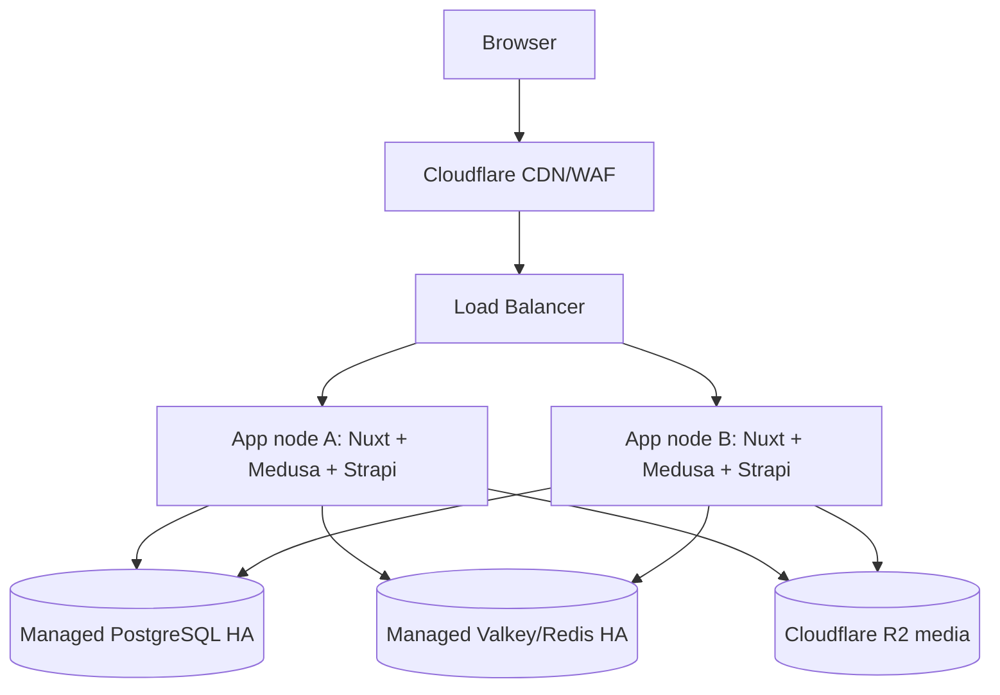

# Production Hosting Pricing

Last updated: 2026-04-29

This document compares production hosting options for `particle-turbo`.

Expected traffic:

- regular traffic: `500 requests/minute` (`~8 requests/second`)
- TV ad spikes: `1,500-3,000 requests/minute` (`~25-50 requests/second`)

Prices are approximate public cloud pricing as of 2026-04-29 and exclude tax/VAT unless noted.

## Option 1 - Minimal Decent Production

Estimated cost: `~EUR 60-90/month`.

Shape:

- 1 VPS with `8-16 vCPU`, `32 GB RAM`, and `500-640 GB NVMe/SSD`
- Docker runs Nuxt, Medusa, Strapi, PostgreSQL, Redis, and Nginx on the same host
- 7-day provider backups/checkpoints
- Cloudflare in front for DNS, CDN, and basic protection

Suggested providers/plans:

- Hetzner `CPX62` plus backups
- Hetzner `CCX33` plus extra storage, if dedicated CPU is preferred

This should run the expected traffic at decent speed if production Dockerfiles, caching, and Cloudflare are configured correctly. The tradeoff is availability: one server failure can take down the full store, including database and cache.

## Option 2 - Best Middle Ground

Estimated cost: `~USD 900-1,200/month`.

Shape:

- 2 app nodes, each `4-8 vCPU` and `16-32 GB RAM`
- DigitalOcean Regional Load Balancer
- Managed PostgreSQL HA, around `8 GB RAM / 4 vCPU` primary plus standby
- Managed Valkey/Redis HA, around `4 GB RAM` primary plus standby
- daily backups and 7-day database recovery
- Cloudflare Pro or Business in front
- DigitalOcean Standard Support (`~USD 99/month`)

This is the best practical production choice. It removes the biggest single-host risks: app server failure, database-in-container failure, unsafe deploys, and manual database backup management. It also leaves enough room for TV ad bursts without paying for excessive unused capacity.

Recommended production architecture:

Runtime data must not depend on app-node local disk. PostgreSQL should be managed or on a separate database server, Redis should be shared, and media should stay on R2/S3.

## Option 3 - Best Of The Best, Still Sensible

Estimated cost: `~USD 2,500/month`, or `~USD 2,750/month` with Cloudflare Business.

Shape:

- 2 app nodes, each `8 vCPU` and `32 GB RAM`
- 2-node/load-scaled regional load balancer
- Managed PostgreSQL HA, around `16 GB RAM / 6 vCPU` primary plus standby
- Managed Valkey/Redis HA, around `8 GB RAM` primary plus standby
- `500 GB` extra storage/log/backup buffer
- daily 7-day backups/checkpoints
- DigitalOcean Premium Support (`~USD 999/month`)
- optional Cloudflare Business (`~USD 250/month`)

Approximate monthly breakdown:

- 2 app servers: `2 x USD 252 = USD 504`
- daily 7-day app-server backups: `~USD 151`
- load balancer: `~USD 24`
- managed PostgreSQL HA: `~USD 489`
- managed Valkey/Redis HA: `~USD 240`
- extra storage/log/backup buffer: `~USD 50`
- monitoring/storage buffer: `~USD 50`
- DigitalOcean Premium Support: `USD 999`

Estimated total: `~USD 2,507/month`.

This is heavily oversized for the expected traffic, but the spend goes toward useful reliability: two app nodes, managed HA database, managed cache, backups, and fast provider support. It is not just buying random unused CPU.

## Recommendation

Launch production on Option 2 unless downtime is expected to have very high revenue or brand impact. Move toward Option 3 before major TV campaigns or when fast vendor response becomes business-critical.

Keep the separate-provider disaster safety net out of scope for now. If added later, prefer Cloudflare health-check failover to a static fallback or warm standby environment.
