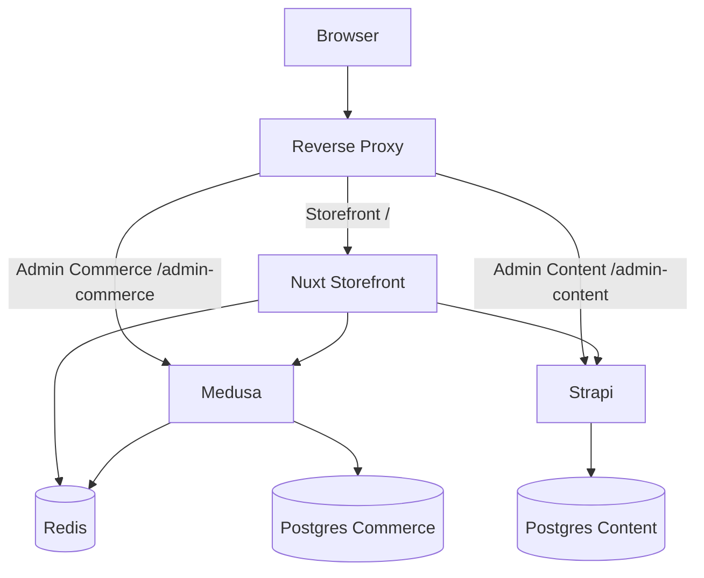

# VPS Deployment Plan

Last updated: 2026-04-29

This plan describes how to deploy `particle-turbo` to a single VPS for QA/staging.

## SSH root@31.220.56.146

## Target URLs

- Storefront: `https://particle-turbo.pfm-qa.com/`
- Medusa Admin/API: `https://particle-turbo.pfm-qa.com/admin-commerce/`
- Strapi Admin/API: `https://particle-turbo.pfm-qa.com/admin-content/`

The initial target is a single VPS running all services in Docker:

- Nuxt storefront
- Medusa commerce
- Strapi content
- PostgreSQL for commerce
- PostgreSQL for content
- Redis
- Reverse proxy with HTTPS

DNS is already pointed correctly:

- `particle-turbo.pfm-qa.com` resolves to `31.220.56.146`

## Recommended Architecture



Use Nginx as the reverse proxy on this VPS. The server already runs host-level Nginx with Certbot-managed certificates for other `pfm-qa.com` apps.

Do not use the existing Caddy container for this project. The host Caddy service is inactive and a Docker container named `caddy` is currently restarting.

## Important Path Prefix Note

Serving Medusa Admin and Strapi Admin under paths like `/admin-commerce/` and `/admin-content/` may require extra base URL/public URL configuration. Some admin apps assume they are served from root.

If either admin panel has broken assets, API calls, redirects, or login after path-prefix proxying, switch to subdomains:

- `commerce.particle-turbo.pfm-qa.com`
- `content.particle-turbo.pfm-qa.com`

Subdomains are usually safer for admin apps, but path routing can be attempted first.

## Current Repo Gap

The current Docker setup is development-oriented:

- `compose.yml` mounts the repo into containers.
- `apps/storefront/Dockerfile` runs Nuxt dev server.
- `apps/commerce/Dockerfile` runs Medusa dev server.
- `apps/content/Dockerfile` runs Strapi dev server.

Production deployment files now exist:

- `compose.prod.yml`
- `apps/storefront/Dockerfile.prod`
- `apps/commerce/Dockerfile.prod`
- `apps/content/Dockerfile.prod`
- reverse proxy config, for example `infra/nginx/particle-turbo.pfm-qa.com.conf`

Production containers should:

- build app artifacts during image build
- not bind-mount source code
- run with `NODE_ENV=production`
- expose app ports only on the Docker network
- expose only `80` and `443` publicly through the reverse proxy

Current readiness: closer, but not deploy-ready until `.env.prod` is created on the VPS, Nginx is installed/enabled for this host, the GitHub deployment branch is pushed, and database/content bootstrap is completed.

Local validation completed on 2026-04-29:

```bash
docker compose -f compose.prod.yml --env-file env config --quiet
docker compose -f compose.prod.yml --env-file env build --progress=plain storefront commerce content
```

Both commands completed successfully.

## Deployment Source

Deploy the VPS from GitHub, not from a local working tree copy.

Use one agreed deployment branch, for example `main` or a dedicated QA branch. The VPS should clone that branch into `/var/www/particle-turbo` and future deployments should update the same checkout with `git fetch` and `git pull`.

Initial clone example:

```bash
git clone --branch <deploy-branch> <github-repo-url> /var/www/particle-turbo
cd /var/www/particle-turbo
```

Update deploy example:

```bash
cd /var/www/particle-turbo
git fetch origin
git pull --ff-only origin <deploy-branch>
docker compose -f compose.prod.yml --env-file .env.prod up -d --build
```

Only committed and pushed code should be deployed. Do not deploy uncommitted local files by copying the local project directory to the VPS.

## Observed VPS State

Checked over SSH as `root@31.220.56.146` on 2026-04-29.

Host:

- Hostname: `pfm-qa`
- OS/kernel: Ubuntu host, Linux `6.8.0-90-generic`
- Docker: `29.0.2`
- Docker Compose plugin: `v2.40.3`
- Docker service: active
- Nginx service: active
- Host Caddy service: inactive
- UFW service: active, but `ufw status` reports inactive

Current project layout:

- Existing apps are under `/var/www`, not `/opt`.
- `/var/www/particle-turbo` does not exist yet.
- `/opt/particle-turbo` does not exist.
- Existing directories include `blurr-tools`, `lost-orders`, `particle_dashboard`, `pfm-chargebacks`, `pfm-marketing`, `pfm-tools`, and `surveys.pfm-qa.com`.

Current proxy setup:

- Nginx is listening on ports `80` and `443`.
- Existing enabled Nginx sites include `surveys.pfm-qa.com`, `marketing.pfm-qa.com`, `tools.pfm-qa.com`, `chargebacks.pfm-qa.com`, and others.
- Nginx config test succeeds, with an existing warning in `tools.pfm-qa.com` about protocol options redefined.
- No enabled Nginx site for `particle-turbo.pfm-qa.com` exists yet.
- Existing Nginx sites proxy to loopback app ports such as `127.0.0.1:3000`, `127.0.0.1:3001`, `127.0.0.1:5173`, and `127.0.0.1:8001`.

Current Docker state:

- Active Compose projects include `blurr-tools`, `lost-orders`, `pfm-chargebacks`, `pfm-marketing`, `pfm-surveys-prod`, and `pfm-tools`.
- A Docker container named `caddy` is restarting and should not be used as the deployment path for this project.
- Public or loopback ports already in use include `3000`, `3001`, `3002`, `3003`, `3010`, `3011`, `5173`, `5175`, `8000`, `8001`, `8080`, `5432`, `5433`, `5434`, and `6379`.

Implications for this deploy:

- Use `/var/www/particle-turbo` as the app directory to match the server.
- Use Nginx + Certbot, not Caddy.
- Do not publish PostgreSQL or Redis ports to the host.
- Publish app containers only to unused loopback ports for Nginx:
    - Storefront: `127.0.0.1:3030 -> 3000`
    - Medusa: `127.0.0.1:9030 -> 9000`
    - Strapi: `127.0.0.1:1338 -> 1337`
- Before starting, re-check ports because this is a shared VPS and active services may change.
- Firewall hardening is still needed because UFW is currently inactive.

## VPS Preparation

## Shared VPS Safety

The target VPS may already host other production projects and Docker containers. Deployment must be non-destructive.

Before making any changes on the VPS:

1. Inventory existing containers, networks, volumes, ports, and reverse proxy config.
2. Do not run broad cleanup commands such as:
    - `docker system prune`
    - `docker volume prune`
    - `docker network prune`
    - `docker compose down` outside this project directory
3. Do not stop, restart, remove, rename, or rebuild containers that are not part of `particle-turbo`.
4. Do not edit shared reverse proxy config without first backing it up.
5. Do not change firewall rules until current open ports and active services are documented.
6. Do not bind project services directly to common public ports already used by other apps.

Use project-specific names for Compose resources:

- Compose project name: `particle-turbo`
- Docker network: `particle-turbo-network`
- Volumes:
    - `particle-turbo-postgres-commerce-data`
    - `particle-turbo-postgres-content-data`
    - `particle-turbo-redis-data`

Recommended inspection commands:

```bash
docker ps
docker compose ls
docker network ls
docker volume ls
ss -tulpn
sudo ufw status
```

Only after confirming there are no conflicts should the new stack be started.

1. Provision Ubuntu VPS.
2. Point DNS `particle-turbo.pfm-qa.com` to the VPS IP.
3. Install Docker Engine and Docker Compose plugin.
4. Create app directory:

```bash
mkdir -p /var/www/particle-turbo
cd /var/www/particle-turbo
```

5. Clone the GitHub repo into `/var/www/particle-turbo` from the agreed deployment branch.
6. Create a VPS-only environment file, for example `.env.prod`.
7. Build and start the production stack.

## Production Compose Requirements

`compose.prod.yml` should use the same service names as the development Compose file where practical, but it must be production-safe for the shared VPS.

Required differences from `compose.yml`:

- Set `name: particle-turbo`.
- Build with `Dockerfile.prod` for each app.
- Do not bind-mount the repository into app containers.
- Set `NODE_ENV=production` for app containers.
- Do not publish PostgreSQL or Redis ports to the host.
- Publish app ports only on loopback:
    - `127.0.0.1:3030:3000` for `storefront`
    - `127.0.0.1:9030:9000` for `commerce`
    - `127.0.0.1:1338:1337` for `content`
- Use project-specific named volumes:
    - `particle-turbo-postgres-commerce-data`
    - `particle-turbo-postgres-content-data`
    - `particle-turbo-redis-data`
- Use an internal Docker network, for example `particle-turbo-network`.

## Nginx Site Plan

Create a new Nginx site for `particle-turbo.pfm-qa.com`; do not modify unrelated enabled sites.

Suggested local repo template path:

- `infra/nginx/particle-turbo.pfm-qa.com.conf`

Suggested VPS target paths:

- `/etc/nginx/sites-available/particle-turbo.pfm-qa.com`
- `/etc/nginx/sites-enabled/particle-turbo.pfm-qa.com`

Initial Nginx shape:

```nginx
server {
    listen 80;
    server_name particle-turbo.pfm-qa.com;
    client_max_body_size 50M;

    location / {
        proxy_pass http://127.0.0.1:3030;
        proxy_http_version 1.1;
        proxy_set_header Upgrade $http_upgrade;
        proxy_set_header Connection "upgrade";
        proxy_set_header Host $host;
        proxy_set_header X-Real-IP $remote_addr;
        proxy_set_header X-Forwarded-For $proxy_add_x_forwarded_for;
        proxy_set_header X-Forwarded-Proto $scheme;
        proxy_cache_bypass $http_upgrade;
    }

    location /admin-commerce {
        return 301 /admin-commerce/;
    }

    location /admin-commerce/ {
        rewrite ^/admin-commerce/?(.*)$ /$1 break;
        proxy_pass http://127.0.0.1:9030;
        proxy_http_version 1.1;
        proxy_set_header Upgrade $http_upgrade;
        proxy_set_header Connection "upgrade";
        proxy_set_header Host $host;
        proxy_set_header X-Real-IP $remote_addr;
        proxy_set_header X-Forwarded-For $proxy_add_x_forwarded_for;
        proxy_set_header X-Forwarded-Proto $scheme;
        proxy_cache_bypass $http_upgrade;
    }

    location /admin-content {
        return 301 /admin-content/;
    }

    location /admin-content/ {
        rewrite ^/admin-content/?(.*)$ /$1 break;
        proxy_pass http://127.0.0.1:1338;
        proxy_http_version 1.1;
        proxy_set_header Upgrade $http_upgrade;
        proxy_set_header Connection "upgrade";
        proxy_set_header Host $host;
        proxy_set_header X-Real-IP $remote_addr;
        proxy_set_header X-Forwarded-For $proxy_add_x_forwarded_for;
        proxy_set_header X-Forwarded-Proto $scheme;
        proxy_cache_bypass $http_upgrade;
    }
}
```

After installing the site:

```bash
nginx -t
systemctl reload nginx
certbot --nginx -d particle-turbo.pfm-qa.com
nginx -t
systemctl reload nginx
```

If either admin panel breaks under the path prefix, switch to subdomains rather than adding complex rewrites.

## Production Environment

Create `.env.prod` on the VPS. Do not commit it.

Core values:

```env
NODE_ENV=production

POSTGRES_COMMERCE_USER=
POSTGRES_COMMERCE_PASSWORD=
POSTGRES_COMMERCE_DB=

POSTGRES_CONTENT_USER=
POSTGRES_CONTENT_PASSWORD=
POSTGRES_CONTENT_DB=

REDIS_URL=redis://redis:6379

MEDUSA_DATABASE_URL=postgres://<user>:<pass>@postgres-commerce:5432/<db>
DATABASE_SSL=false
MEDUSA_REDIS_URL=redis://redis:6379
MEDUSA_JWT_SECRET=
MEDUSA_COOKIE_SECRET=
MEDUSA_ADMIN_EMAIL=
MEDUSA_ADMIN_PASSWORD=

NUXT_PUBLIC_MEDUSA_URL=https://particle-turbo.pfm-qa.com/admin-commerce
NUXT_PUBLIC_STRAPI_URL=https://particle-turbo.pfm-qa.com/admin-content
NUXT_MEDUSA_INTERNAL_URL=http://commerce:9000
NUXT_STRAPI_INTERNAL_URL=http://content:1337
NUXT_MEDUSA_API_KEY=
NUXT_STRAPI_API_TOKEN=
NUXT_REDIS_URL=redis://redis:6379

STORE_CORS=https://particle-turbo.pfm-qa.com
ADMIN_CORS=https://particle-turbo.pfm-qa.com
AUTH_CORS=https://particle-turbo.pfm-qa.com

BRAINTREE_ENABLED=true
BRAINTREE_ENVIRONMENT=sandbox
BRAINTREE_MERCHANT_ID=
BRAINTREE_PUBLIC_KEY=
BRAINTREE_PRIVATE_KEY=
BRAINTREE_MERCHANT_ACCOUNT_ID=
BRAINTREE_SUBMIT_FOR_SETTLEMENT=true

STRAPI_JWT_SECRET=
STRAPI_ADMIN_JWT_SECRET=
STRAPI_API_TOKEN_SALT=
STRAPI_APP_KEYS=
STRAPI_ADMIN_EMAIL=
STRAPI_ADMIN_INITIAL_PASSWORD=

R2_ACCESS_KEY_ID=
R2_SECRET_ACCESS_KEY=
R2_ENDPOINT=
R2_BUCKET=
R2_PUBLIC_URL=
R2_REGION=auto

CORS_ORIGIN=https://particle-turbo.pfm-qa.com
HOST=0.0.0.0
PORT=1337
```

Secrets should be generated fresh for the VPS. Do not reuse local development secrets.

## App Configuration Checks

Before launch, verify:

- Nuxt uses internal Docker URLs for server-to-server calls and public HTTPS URLs for browser-visible URLs.
- Medusa CORS allows `https://particle-turbo.pfm-qa.com`.
- Strapi CORS allows `https://particle-turbo.pfm-qa.com`.
- Strapi public URL/base URL works under `/admin-content/`, or switch Strapi to a subdomain.
- Medusa Admin works under `/admin-commerce/`, or switch Medusa to a subdomain.
- The local development admin/customer bridge is disabled in production by `NODE_ENV=production`.

## Data Bootstrap

Initial VPS boot order:

1. Start PostgreSQL and Redis.
2. Start Medusa.
3. Run Medusa migrations.
4. Seed/import Medusa regions, products, variants, prices, shipping setup, and Braintree config.
5. Start Strapi.
6. Create the Strapi admin user.
7. Apply Strapi schemas and import page/PDP content.
8. Create Strapi read-only API token.
9. Create Medusa publishable API key.
10. Add those API keys to `.env.prod`.
11. Rebuild/restart storefront.

## Moving Local Database Data To VPS

To avoid manually recreating Medusa products, prices, PPU rules, orders, Strapi pages, PDP sections, and content, migrate the local PostgreSQL databases to the VPS.

There are two databases:

- Commerce DB: Medusa data in `postgres-commerce`
- Content DB: Strapi data in `postgres-content`

Media files are not stored in the database. Strapi media records and Medusa product image URLs point to Cloudflare R2, so the VPS must use the same R2 bucket/public URLs or a copied equivalent bucket with matching URLs.

### Recommended Migration Timing

For the first QA VPS deploy, prefer restoring the local dumps into fresh empty VPS databases before users create data on the VPS.

If the VPS already has meaningful data, do not overwrite it blindly. First take VPS backups, then decide whether to merge or replace.

### Step 1 — Stop App Writes Locally

Before dumping local data, avoid changing content/orders during the export.

Recommended:

```bash
docker compose stop storefront commerce content
docker compose up -d postgres-commerce postgres-content redis
```

This keeps databases running but stops app writes.

### Step 2 — Dump Local Commerce DB

From the local project root:

```bash
mkdir -p backups

docker compose exec -T postgres-commerce pg_dump \
  -U "$POSTGRES_COMMERCE_USER" \
  -d "$POSTGRES_COMMERCE_DB" \
  --clean \
  --if-exists \
  --no-owner \
  --no-privileges \
  > backups/commerce-local.sql
```

If shell variable expansion is inconvenient on Windows, use the concrete local values from `env`:

```bash
docker compose exec -T postgres-commerce pg_dump \
  -U medusa \
  -d medusa_db \
  --clean \
  --if-exists \
  --no-owner \
  --no-privileges \
  > backups/commerce-local.sql
```

### Step 3 — Dump Local Strapi DB

```bash
docker compose exec -T postgres-content pg_dump \
  -U "$POSTGRES_CONTENT_USER" \
  -d "$POSTGRES_CONTENT_DB" \
  --clean \
  --if-exists \
  --no-owner \
  --no-privileges \
  > backups/content-local.sql
```

Windows/concrete-value version:

```bash
docker compose exec -T postgres-content pg_dump \
  -U strapi \
  -d strapi_db \
  --clean \
  --if-exists \
  --no-owner \
  --no-privileges \
  > backups/content-local.sql
```

### Step 4 — Copy Dumps To VPS

Example:

```bash
scp backups/commerce-local.sql root@<vps-ip>:/var/www/particle-turbo/backups/
scp backups/content-local.sql root@<vps-ip>:/var/www/particle-turbo/backups/
```

Use the actual VPS user/path chosen for deployment.

### Step 5 — Back Up VPS Databases Before Import

Even on a fresh VPS, take a pre-import backup if the databases already exist:

```bash
mkdir -p /var/www/particle-turbo/backups/pre-import

docker compose -f compose.prod.yml --env-file .env.prod exec -T postgres-commerce pg_dump \
  -U "$POSTGRES_COMMERCE_USER" \
  -d "$POSTGRES_COMMERCE_DB" \
  --no-owner \
  --no-privileges \
  > backups/pre-import/commerce-before-import.sql

docker compose -f compose.prod.yml --env-file .env.prod exec -T postgres-content pg_dump \
  -U "$POSTGRES_CONTENT_USER" \
  -d "$POSTGRES_CONTENT_DB" \
  --no-owner \
  --no-privileges \
  > backups/pre-import/content-before-import.sql
```

### Step 6 — Stop VPS App Containers Before Restore

```bash
docker compose -f compose.prod.yml --env-file .env.prod stop storefront commerce content
docker compose -f compose.prod.yml --env-file .env.prod up -d postgres-commerce postgres-content redis
```

### Step 7 — Restore Commerce DB On VPS

```bash
docker compose -f compose.prod.yml --env-file .env.prod exec -T postgres-commerce psql \
  -U "$POSTGRES_COMMERCE_USER" \
  -d "$POSTGRES_COMMERCE_DB" \
  < backups/commerce-local.sql
```

### Step 8 — Restore Strapi DB On VPS

```bash
docker compose -f compose.prod.yml --env-file .env.prod exec -T postgres-content psql \
  -U "$POSTGRES_CONTENT_USER" \
  -d "$POSTGRES_CONTENT_DB" \
  < backups/content-local.sql
```

### Step 9 — Start Apps And Run Compatibility Checks

```bash
docker compose -f compose.prod.yml --env-file .env.prod up -d commerce content storefront
```

Then verify:

- Medusa starts without pending migration errors.
- Strapi starts and can read existing content schemas.
- Medusa Admin login works.
- Strapi Admin login works.
- Storefront can read Strapi content and Medusa products.
- PDP pages load images from R2.
- PPU rules exist in Medusa Admin.
- Quantity pricing tiers exist in Medusa.
- Existing test orders appear in Medusa.

### R2 Media Considerations

The database contains media records and URLs, but the files live in R2.

Use one of these approaches:

1. **Reuse the same R2 bucket for QA.**
    - Fastest.
    - No URL rewriting needed.
    - Best for internal QA if current bucket is already non-production.

2. **Copy local/dev R2 objects to a QA bucket.**
    - Safer separation.
    - Requires either preserving the same public URL pattern or rewriting URLs in Strapi/Medusa records.

If changing R2 public URL, inspect and update affected database fields carefully. Do not run blind global replacements without a DB backup.

### After Import

After restore, regenerate or verify environment-dependent values:

- Medusa publishable API key used by Nuxt.
- Strapi read-only API token used by Nuxt.
- Braintree sandbox credentials.
- CORS values for `particle-turbo.pfm-qa.com`.
- Admin passwords and user access.

If the local database contains local-only secrets or tokens, rotate them on the VPS.

## Payment and PPU Verification

For QA, keep Braintree sandbox enabled.

Verify:

1. Checkout loads Braintree Hosted Fields.
2. Original checkout payment is submitted for settlement.
3. Matching PPU rule redirects to `/post-purchase-upsell`.
4. Accepting PPU creates a second Braintree transaction.
5. PPU item is added to the same Medusa order.
6. Order metadata shows:
    - `ppu_status: processed`
    - `ppu_release_reason: accepted`
    - `ppu_products_count`
    - `ppu_products_value`
7. `/account` shows the order.

## Admin Setup

Medusa Admin:

- URL target: `/admin-commerce/`
- Configure/check Braintree under Settings.
- Configure PPU rules under Settings → Post-purchase upsells.
- Create publishable API key for storefront.

Strapi Admin:

- URL target: `/admin-content/`
- Confirm media upload uses R2.
- Confirm content APIs are readable by the storefront token.

## Backups

Before the VPS is used seriously for QA, add backups.

Minimum backup scope:

- `postgres-commerce`
- `postgres-content`

Suggested approach:

- daily `pg_dump` for both databases
- compressed timestamped backup files
- store backups outside Docker volumes
- copy backups off-server, ideally to R2 or another backup target
- retain at least 7 daily backups and 4 weekly backups

Restore procedures must be documented and tested once.

## Security Checklist

- Open only ports `22`, `80`, and `443`.
- Do not expose PostgreSQL, Redis, Medusa, Strapi, or Nuxt app ports publicly.
- Use strong generated secrets.
- Keep Braintree in sandbox for QA.
- Use production `NODE_ENV=production`.
- Do not commit `.env.prod`.
- Consider basic auth or IP allowlist for `/admin-commerce/` and `/admin-content/`.
- Rotate admin passwords before sharing QA access.
- Confirm the dev admin/customer account bridge is not available in production.

## Smoke Test Checklist

After every deploy:

- Home page loads over HTTPS.
- PDP loads Strapi content and Medusa price data.
- Add to cart works.
- Cart quantity update/remove works.
- Checkout completes.
- Braintree original transaction is submitted for settlement.
- PPU offer appears for matching rules.
- PPU accept works and adds item to same order.
- Thank-you page loads.
- Account page shows placed order.
- Medusa Admin loads.
- Strapi Admin loads.
- Public cached pages are fast.
- Cart, checkout, payment, account, and PPU routes are not cached.

## Known Follow-Ups Before Production

- Normalize Medusa payment collection/payment state with Braintree `submitted_for_settlement`.
- Replace direct PPU order table inserts with official Medusa order workflows if a stable workflow supports this case.
- Add delete/duplicate controls for PPU rules in Medusa Admin.
- Add a formal backup/restore script.
- Decide whether admin paths should stay path-based or move to subdomains.
